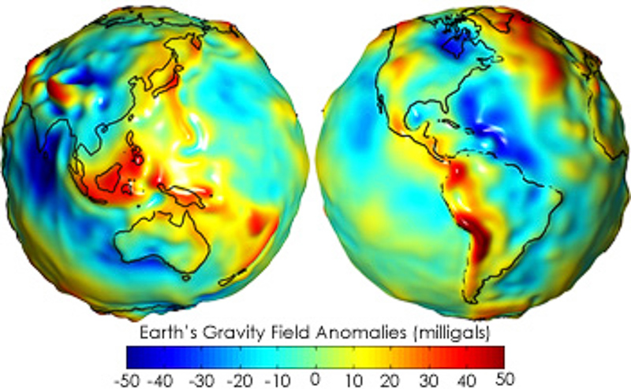

# Práctica de la sintaxis Markdown
## Encabezados
# Encabezados de nivel 1
## Encabezados de nivel 2
...
##### Encabezado de nivel 5
###### Encabezado de nivel 6

## Itálicas
*Texto en Itálicas*
\
_Texto en Itálicas_

## Negritas
**Texto en negrita**
\
__Otro texto en negrita__

***Texto en negrita y en italica***
\
_**Texto en negrita y en italica**_

## Citas textuales
>_En un lugar de la Mancha...
\
Miguel de Cervantes (1605)

## Hiperbinculos
[Sitio Web de los videos del curso](https://www.youtube.com/channel/UC54fLwQJYtc9szJzNvH7zhw/featured)

## Imágenes
### Un Geoide de internet

### Otro Geoide pero desde la computadora

## Listas

# HTML
<h1>Encabezadode nivel 1</h1>
<h2>Encabezadode nivel 2</h2>
...
<h6>Encabezadode nivel 6</h6>

<strong>Texto en negrita<strong>
\
<en>Texto en Italica<en>

<a href="https://www.youtube.com/channel/UC54fLwQJYtc9szJzNvH7zhw/featured">Sitio Web de los videos del curso en la misma ventana</a>
\
<a href="https://www.youtube.com/channel/UC54fLwQJYtc9szJzNvH7zhw/featured" target="_blank">Sitio Web de los videos del curso en otra ventana</a>
